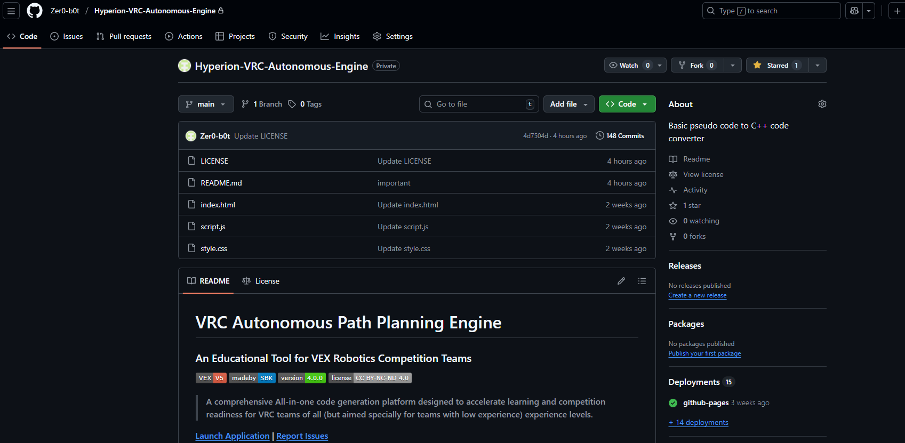
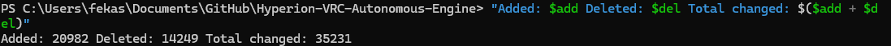

# Hyperion – VRC Autonomous Path Planning Engine

### Public Project Notice (Source Code Private)

> An autonomous path planning and code generation engine for  
> **VEX Robotics Competition (VRC)** teams.

---

## ⚠️ Source Code Status

The **Hyperion Autonomous Engine** exists and is actively developed,  
however the **source code is currently private** due to an ongoing  
VEX Robotics Competition phase (2 competetions on the **27th** and **3th**).

This repository exists to:
- publicly document the project’s existence
- establish development timeline
- provide non-sensitive overview and visuals

**No source code is published here intentionally.**

---

## Project Overview

Hyperion is designed to help VRC teams:
- plan autonomous paths visually
- generate command-based VEXcode V5 output
- reduce manual math and tuning overhead
- focus on strategy instead of syntax

The system emphasizes **education**, **clarity**, and **competition reliability**.

---

## What Is Intentionally Omitted
- Source code
- Mathematical conversion formulas
- Internal algorithms
- Configuration logic

These will remain private until the competition season concludes  
(or may remain private indefinitely).
(However can show the code on request as a proof of existance)

---

## Visual Previews

> Representative visuals from the development version  
> (no code or sensitive data shown)

> 

> Path UI
>
> 

> Proof of ownership
---

## License

This project is licensed under  
**Creative Commons Attribution–NonCommercial–NoDerivatives 4.0**

See [LICENSE](LICENSE) for full terms.

---

## Contact

- Instagram: **@serdar_burak_karagoz**
- Email: **fekasbhy@gmail.com**

